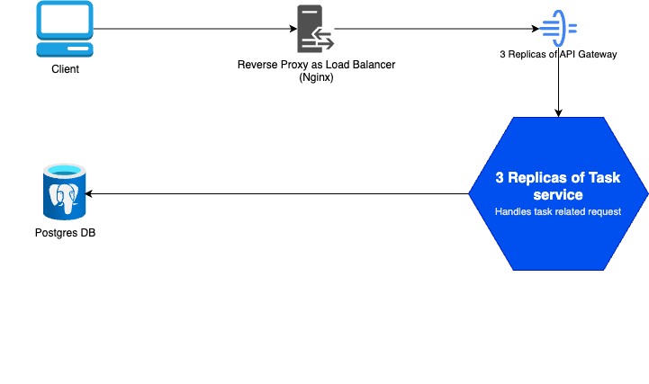
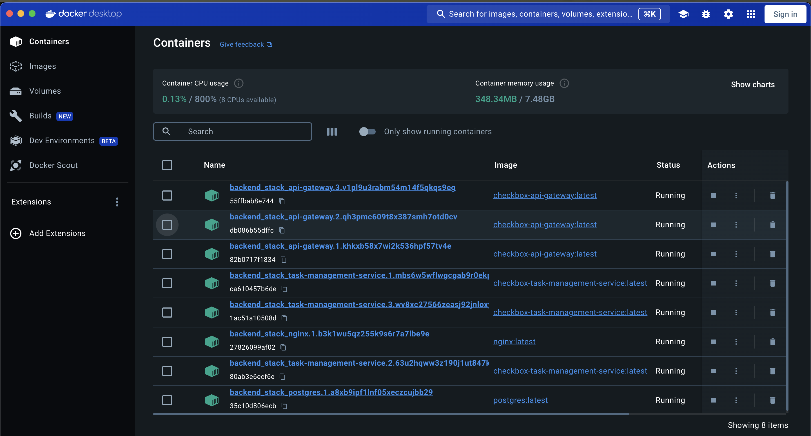
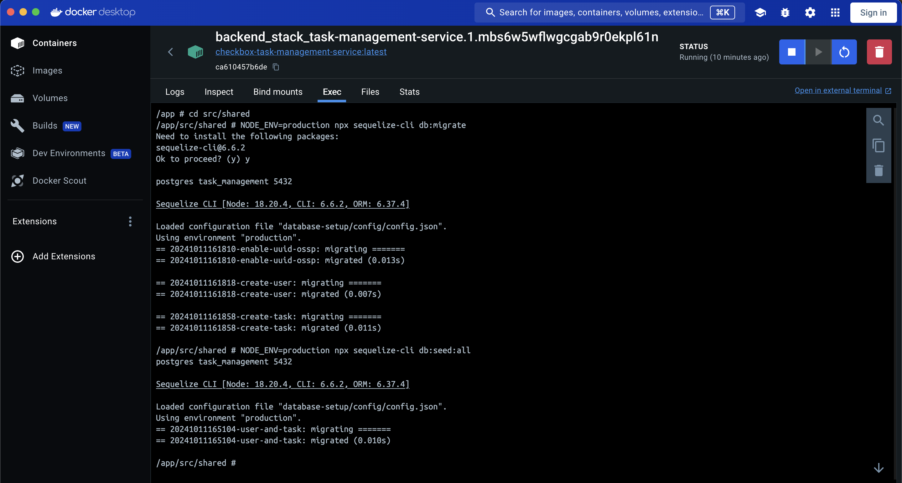

<a id="readme-top"></a>

<!-- TABLE OF CONTENT -->

## Table of Content

  <ol>
    <li>
      <a href="#about-the-project">About The Project</a>
      <ul>
        <li><a href="#built-with">Built With</a></li>
      </ul>
    </li>
    <li>
      <a href="#getting-started">Getting Started</a>
      <ul>
        <li><a href="#prerequisites">Prerequisites</a></li>
        <li><a href="#steps-to-get-it-running">Steps to get it running</a></li>
      </ul>
    </li>
    <li><a href="#usage">Usage</a></li>
    <li><a href="#roadmap">Roadmap</a></li>
    <li><a href="#acknowledgments">Acknowledgments</a></li>
  </ol>

<!-- ABOUT THE PROJECT -->

## About The Project

This project is a NestJS Project that simply acts as an API Gateway that allows other microservice to interact with it. Feel free to use it along with other standalone services. The the microservice for this example project is:

<ol>
    <li>
    <a href="https://github.com/AldroidOng/checkbox-task-management-service">Task Management service </a> (Service meant for serving task related request): 
  </li>
</ol>

It also uses the git submodule (<a href="https://github.com/AldroidOng/checkbox-backend-shared">shared</a>) to share config setup, types (mainly dto between API gateway and microservices), etc across microservice and api gateway project.

You can walkthrough on this project guide to use this solely for working on API level. Else you can also use the client developed using NEXT.JS via this github <a href="https://github.com/AldroidOng/checkbox-task-management-portal">link</a>

The architecture diagram for this demo would look like below:

<div align="center">
  
</div>

<p align="right">(<a href="#readme-top">back to top</a>)</p>

### Techs Involve

- [![Nest][Nest.js]][Nest-url]
- [![Postgresql][postgresql]][postgresql-url]
- [![Docker][docker]][docker-url]
- [![Nginx][nginx]][nginx-url]

<p align="right">(<a href="#readme-top">back to top</a>)</p>

<!-- GETTING STARTED -->

## Getting Started

### Prerequisites

Ensure you have below software installed on your machine:

<ol>
    <li>
    <a href="https://www.docker.com/">Docker</a>
  </li>
  <li>
    <a href="https://git-scm.com/">Git</a>
  </li>
</ol>

### Steps to get it running

1. Create a working directory that you wish to store your services. Example of folder for reference: Backend
2. Clone the following repositories into the working directory you created (Backend)
   ```sh
   git clone https://github.com/AldroidOng/checkbox-api-gateway.git
   git clone https://github.com/AldroidOng/checkbox-task-management-service.git
   ```
3. Inside the working directory (Backend), create a `docker-compose.yml` and insert the following code (feel free to adjust the config however you see fit):

   ```yml
   version: '3.8'
   services:
     api-gateway:
       image: checkbox-api-gateway:latest
       ports:
         - '3000:3000'
       deploy:
         replicas: 3
         restart_policy:
           condition: on-failure
       networks:
         - app-network
       environment:
         - DB_HOST=postgres
         - DB_PORT=5432
         - DB_USERNAME=username
         - DB_PASSWORD=password
         - DB_NAME=task_management
         - DUE_SOON_DAYS_AWAY=7
         - TASK_MICROSERVICE_HOST=task-management-service
         - TASK_MICROSERVICE_PORT=3001

     task-management-service:
       image: checkbox-task-management-service:latest
       deploy:
         replicas: 3
         restart_policy:
           condition: on-failure
       networks:
         - app-network
       environment:
         - DB_HOST=postgres
         - DB_PORT=5432
         - DB_USERNAME=username
         - DB_PASSWORD=password
         - DB_NAME=task_management
         - DUE_SOON_DAYS_AWAY=7
         - TASK_MICROSERVICE_HOST=0.0.0.0
         - TASK_MICROSERVICE_PORT=3001

     postgres:
       image: postgres:latest
       networks:
         - app-network
       deploy:
         restart_policy:
           condition: on-failure
       environment:
         - POSTGRES_USER=username
         - POSTGRES_PASSWORD=password
         - POSTGRES_DB=task_management
       volumes:
         - postgres_data:/var/lib/postgresql/data

     nginx:
       image: nginx:latest
       deploy:
         restart_policy:
           condition: on-failure
       volumes:
         - ./nginx/nginx.conf:/etc/nginx/nginx.conf
       ports:
         - '80:80'
       networks:
         - app-network
   networks:
     app-network:
       driver: overlay
   volumes:
     postgres_data:
   ```

4. Inside the same working directory (briohr), create a script file `add-submodule.sh` and insert the following code to automatically add the sub modules into the respective services:

   ```sh
   #!/bin/bash
   # List of repositories to update
   REPOS=(
   "checkbox-api-gateway"
   "checkbox-task-management-service"
   )

   # URL of the submodule
   SUBMODULE_URL="https://github.com/AldroidOng/checkbox-backend-shared.git"
   SUBMODULE_PATH="src/shared"

   for REPO in "${REPOS[@]}"; do
   echo "Processing repository: $REPO"

   # Enter the repository directory
   cd $REPO || { echo "Failed to enter directory $REPO"; exit 1; }

   # Check if the submodule path exists
   if [ -d "$SUBMODULE_PATH" ]; then
     if [ -d "$SUBMODULE_PATH/.git" ]; then
       # Submodule path exists and is a Git repository
       echo "Submodule directory '$SUBMODULE_PATH' exists and is already a Git repository."
       echo "Updating submodule..."
       git submodule update --recursive || { echo "Failed to update submodule in $REPO"; exit 1; }
       git submodule update --remote
     else
       # Submodule path exists but is not a Git repository
       echo "Submodule directory '$SUBMODULE_PATH' exists but is not a Git repository."
       echo "Initializing submodule..."
       git submodule init || { echo "Failed to initialize submodule in $REPO"; exit 1; }
       git submodule update --recursive || { echo "Failed to update submodule in $REPO"; exit 1; }
       git submodule update --remote
     fi
   else
     # Submodule path does not exist
     echo "Submodule directory '$SUBMODULE_PATH' does not exist."
     echo "Initializing submodule..."
     git submodule add https://github.com/AldroidOng/checkbox-backend-shared.git src/shared
   fi

   # Return to the parent directory
   cd ..
   done

   echo "Submodule update complete for all repositories."
   ```

5. Open the terminal pointing to the working directory and run below command to allow all involved services to add in the shared service as part of git submodule

   ```sh
   chmod +x add-submodule.sh
   ./add-submodule.sh
   ```

6. In working directory, create a folder named `nginx` and inside this folder, create a file `nginx.conf` to use nginx as a load balancer to handle high volume of request. The code inside the `nginx.conf` is as below:

   ```sh
   events {
       worker_connections 1024;
   }

   http {
       upstream api_gateway {
           server api-gateway:3000;
       }

       server {
           listen 80;

           location / {
               proxy_pass http://api_gateway;
               proxy_set_header Host $host;
               proxy_set_header X-Real-IP $remote_addr;
               proxy_set_header X-Forwarded-For $proxy_add_x_forwarded_for;
               proxy_set_header X-Forwarded-Proto $scheme;
           }
       }
   }
   ```

7. In the same terminal, run

   ```markdown
   ### Run this command to initialize the Swarm if you have never done before

   docker swarm init

   ### To check the status of your Swarm and see the nodes

   docker node ls

   ### Run this command to build the docker image for API Gateway service

   docker build -t checkbox-api-gateway ./checkbox-api-gateway

   ### Run this command to build the docker image for Task management service

   docker build -t checkbox-task-management-service ./checkbox-task-management-service

   ### Deploy stack

   docker stack deploy -c docker-compose.yml backend_stack
   ```

8. You should now be able to see the containes spun up for the respective services as below.
   

9. Next is to run the migration file and seed for the postgres database. You can access one of the backend_stack_task-management-service container and go to the Exec tab and execute the codes as below. (There shuold be perhaps a way to automate this migration step)
   

10. You may now proceed to test for the API via postman by doing a GET request:
    http://localhost:80/task?email=user1@example.com

<p align="right">(<a href="#readme-top">back to top</a>)</p>

<!-- USAGE EXAMPLES -->

## Usage

To help you get started with the API, you can import the Postman collection by:

1. Acessing it via URL (**[Postman Collection URL](https://www.postman.com/technical-astronaut-84109455/nestjs-microservice/collection/6ffe7gv/task-service?action=share&creator=21714473)**) OR

2. Forking it into your own workspace by clicking on the Run In Postman button below:

   [](https://god.gw.postman.com/run-collection/21714473-f5e8874f-980c-43b2-b706-a556b513cef6?action=collection%2Ffork&source=rip_markdown&collection-url=entityId%3D21714473-f5e8874f-980c-43b2-b706-a556b513cef6%26entityType%3Dcollection%26workspaceId%3Df6278dc9-3a37-470f-97de-975c713ca180)

Then, you may test the connection to the task service by running the GET http://localhost:80/task?email=user1@example.com

<!-- ROADMAP -->

## Roadmap

- [ ] Automate the DB migration
- [ ] Enhance for better connection integration between services with other transport type and for better scaling
- [ ] Can further enhance on this project to include create user service and having middleware authentication with NestJS Guards
- [ ] Assess on scaling the containers automatically. Can try with using on cloud like AWS to scale pods based on memory and CPU% usage

<p align="right">(<a href="#readme-top">back to top</a>)</p>

<!-- MARKDOWN LINKS & IMAGES -->
<!-- https://www.markdownguide.org/basic-syntax/#reference-style-links -->

[Nest.js]: https://img.shields.io/badge/nestjs-E0234E?style=for-the-badge&logo=nestjs&logoColor=white
[Nest-url]: https://nestjs.com/
[postgresql]: https://img.shields.io/badge/postgresql-4169E1?style=for-the-badge&logo=postgresql&logoColor=white
[postgresql-url]: https://www.postgresql.org/
[docker]: https://img.shields.io/badge/docker-2496ED?style=for-the-badge&logo=docker&logoColor=white
[docker-url]: https://www.docker.com/
[nginx]: https://img.shields.io/badge/nginx-009639?style=for-the-badge&logo=nginx&logoColor=white
[nginx-url]: https://nginx.org/en/
